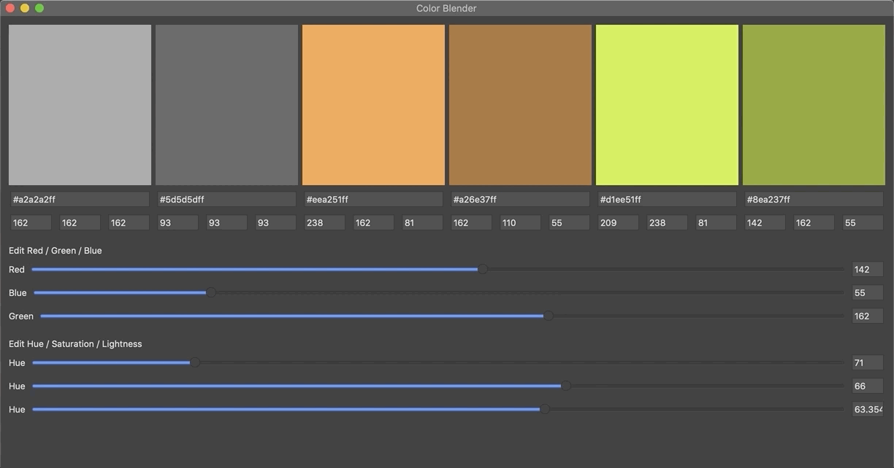

# VS4Mac Color Helper

**Color Helper** is a Visual Studio for macOS addin to add some color helper tools.

* Convert color formats easily (hex, rgb).
* Color matching and palette design. ColorBlender is based on: http://www.colorblender.com

## Licenses

This project uses some third-party assets with a license that requires attribution:

- [ColorBlender](https://github.com/wieslawsoltes/ColorBlender): A .NET library for color matching and palette design by Wiesław Šoltés.

## Copyright and license

Code released under the [MIT license](https://opensource.org/licenses/MIT).